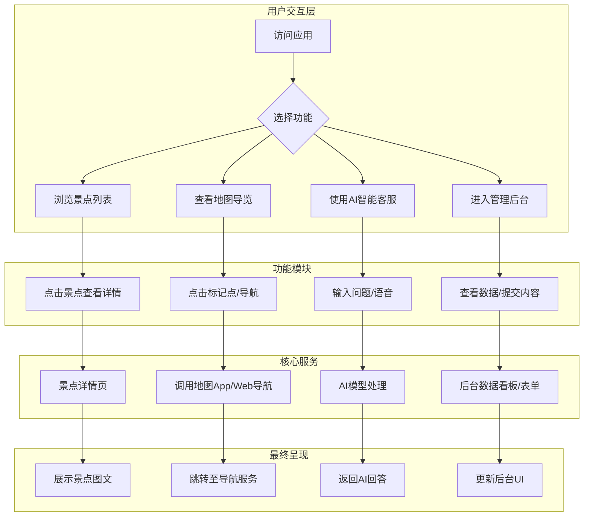
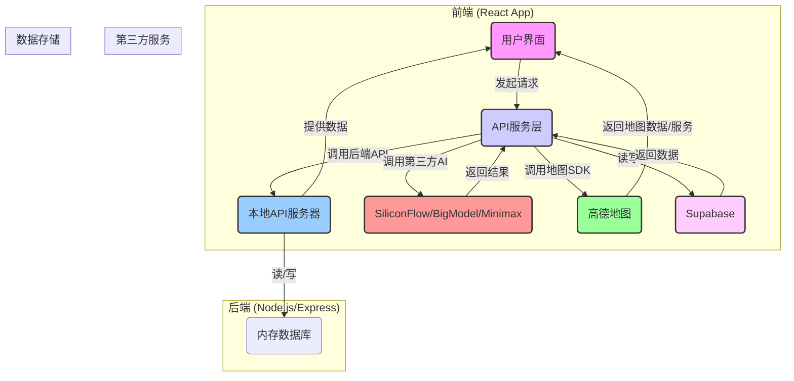

# 项目逻辑与数据流图

本文档使用 Mermaid.js 语法，为您清晰地展示项目的核心业务逻辑和数据流动路径。

## 1. 项目逻辑业务流映射图 (Business Logic Flow)

这张图描绘了用户在“东里村智能导游系统”中的主要交互路径。

## 2. 总数据流逻辑图 (Overall Data Flow)

这张图展示了数据如何在系统的前后端、API服务以及第三方依赖之间进行流动。

